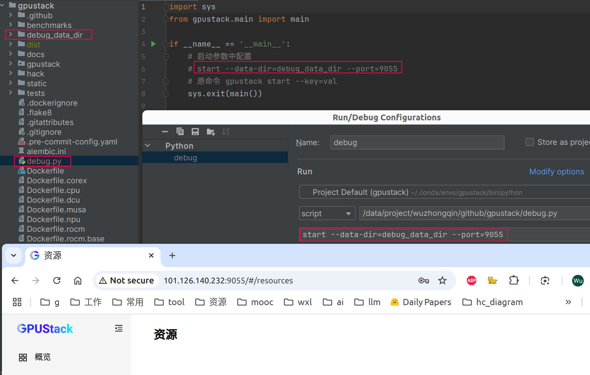

# 配置基本环境

```bash
conda create -n gpustack python=3.10 -y
conda activate gpustack

git clone https://github.com/gpustack/gpustack.git
cd gpustack

make install
make lint
make test
make build
```

# 进行debug
## 屏蔽原来的 gpustack

```bash
whereis gpustack
# 输出 /data/project/wuzhongqin/.conda/envs/gpustack/bin/gpustack


cd /data/project/wuzhongqin/.conda/envs/gpustack/bin/gpustack
mv gpustack _backup_gpustack
```

## 在 gpustack项目根目录下创建 debug.py

- 这个内容就是 原gpustack里面的内容

```python
import sys
from gpustack.main import main

if __name__ == '__main__':
    sys.exit(main())
```

## 配置pycharm
- start 选项见 gpustack/cmd/start.py
```
start --data-dir=debug_data_dir --port=9055 --debug
```



# 关键代码
- 程序入口: gpustack/main.py
- server/server.py


## 手动安装 pip install vllm==0.9.1
```bash
conda activate gpustack
pip install vllm==0.9.1
```
